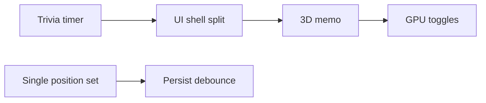

# Performance & Structure Refactor — Implementation Plan

> **For agentic workers:** REQUIRED SUB-SKILL: Use superpowers:subagent-driven-development (recommended) or superpowers:executing-plans to implement this plan task-by-task. Steps use checkbox (`- [ ]`) syntax for tracking.

**Goal:** Reduce React re-render blast radius and main-thread/GPU cost without changing gameplay rules, while splitting the two largest monoliths (`store.ts`, `SpaceBoardGame.tsx`) into maintainable units.

**Architecture:** Six small PRs in dependency order: (1) isolate trivia timer from the 3D viewport, (2) collapse per-step `players` updates in `rollDice` into one commit after the same total wait, (3) split UI shell so `GameScene` is not a descendant of high-frequency state, (4) memoize and narrow Zustand subscriptions in 3D layer, (5) debounce persist writes, (6) optional GPU budget toggles. Store file extraction is a follow-on PR chain after PR 2 stabilizes `rollDice` timing.

**Tech Stack:** React 19, Vite 8, Zustand 5 (`persist`), React Three Fiber 9, drei, Vitest 4, oxlint.

## Global Constraints

- **No gameplay rule changes** — same room outcomes, timings felt by the player (dice, walk, modals) unless explicitly measured and matched.
- **Do not delete or reset user `localStorage`** — migrate via existing `persist.version` only if shape changes.
- **Run before each PR merge:** `npm test`, `npm run build`, `npm run lint`.
- **Commits:** one logical unit per task below; user must ask before `git push`.
- **Imports at top of file** — no inline imports (workspace rule).
- **Exhaustive `switch` on unions** — `never` in `default` (workspace rule).

**Source audit:** thermo-nuclear review (structure + re-render + GPU/CPU). Issues 06–09 should land **after** PR 1–3 minimum.

---

## File map (target end state)

| Path | Responsibility |
|------|----------------|
| `src/games/space-board/SpaceBoardShell.tsx` | Layout only: `phase`, `onExit`, children slots |
| `src/games/space-board/SpaceBoardPanel.tsx` | Left panel HUD (subscribes to HUD fields only) |
| `src/games/space-board/BoardViewport.tsx` | `React.memo` wrapper around `GameScene` + scene overlays that need 3D |
| `src/games/space-board/modals/TriviaOverlay.tsx` | Trivia UI + countdown (owns timer) |
| `src/games/space-board/modals/*.tsx` | Shop, mystery, portal, target, victory, minimap |
| `src/games/space-board/dice/*.tsx` | `DiceTray`, `BigDiceRollOverlay`, shared pip helpers |
| `src/game/store.ts` | Thin re-export + `create` (shrinks over time) |
| `src/game/store/rollDice.ts` | Async turn runner (extracted from monolith) |
| `src/game/store/portalAck.ts` | Replace module globals with closable promise API |
| `src/game/persist/debounceStorage.ts` | Debounced `localStorage.setItem` |
| `src/three/GameScene.tsx` | Canvas composition only |
| `src/three/BoardRooms.tsx` | `rooms.map` → `SpaceRoom` |
| `src/three/BoardAvatars.tsx` | Player avatars map |
| `src/three/CameraRig.tsx` | `SceneControls` + `frameloop` coordination |

---

## PR 1 — Trivia timer isolation (CRITIC re-render)

**Merge criteria:** During active trivia, React DevTools Profiler shows `GameScene` / `BoardViewport` **not** re-rendering every frame; only timer subtree updates.

### Task 1.1: `TriviaOverlay` owns countdown

**Files:**
- Create: `src/games/space-board/modals/TriviaOverlay.tsx`
- Modify: `src/games/space-board/SpaceBoardGame.tsx` (remove trivia block + hook from root)
- Modify: `src/games/space-board/TriviaAnswerTimer.tsx`
- Test: add `src/games/space-board/TriviaAnswerTimer.test.tsx`

**Interfaces:**
- Consumes: `useGameStore` selectors `pendingTrivia`, `answerTrivia`
- Produces: `export function TriviaOverlay()` — self-contained modal

- [ ] **Step 1: Write failing test for countdown without parent re-renders**

```typescript
// src/games/space-board/TriviaAnswerTimer.test.tsx
import { render, act } from "@testing-library/react";
import { describe, expect, test, vi, beforeEach, afterEach } from "vitest";
import { useRef } from "react";
import { useTriviaCountdown } from "./TriviaAnswerTimer";

function Probe({ onExpire }: { onExpire: () => void }) {
  const renders = useRef(0);
  renders.current += 1;
  useTriviaCountdown({ active: true, resetKey: "q1", onExpire });
  return <span data-testid="renders">{renders.current}</span>;
}

describe("useTriviaCountdown", () => {
  beforeEach(() => vi.useFakeTimers());
  afterEach(() => vi.useRealTimers());

  test("updates progress without exceeding ~2 renders per second on average", async () => {
    const onExpire = vi.fn();
    const { getByTestId } = render(<Probe onExpire={onExpire} />);
    const before = Number(getByTestId("renders").textContent);
    await act(async () => {
      await vi.advanceTimersByTimeAsync(500);
    });
    const after = Number(getByTestId("renders").textContent);
    expect(after - before).toBeLessThan(12);
  });
});
```

- [ ] **Step 2: Run test — expect FAIL** (current rAF sets state every frame → many renders)

Run: `npm test -- src/games/space-board/TriviaAnswerTimer.test.tsx`
Expected: FAIL (`after - before` too large)

- [ ] **Step 3: Throttle React updates in `useTriviaCountdown`**

In `TriviaAnswerTimer.tsx`, keep `requestAnimationFrame` for smooth ring but only call `setProgress` when progress delta ≥ `1/120` OR `setSecondsLeft` when ceiling second changes:

```typescript
let lastProgress = 1;
let lastSecond = TRIVIA_ANSWER_SECONDS;

const tick = () => {
  if (cancelled) return;
  const elapsed = performance.now() - start;
  const remaining = Math.max(0, TRIVIA_ANSWER_MS - elapsed);
  const nextProgress = remaining / TRIVIA_ANSWER_MS;
  const nextSecond = remaining <= 0 ? 0 : Math.ceil(remaining / 1000);

  if (Math.abs(nextProgress - lastProgress) >= 1 / 120) {
    lastProgress = nextProgress;
    setProgress(nextProgress);
  }
  if (nextSecond !== lastSecond) {
    lastSecond = nextSecond;
    setSecondsLeft(nextSecond);
  }
  // ... expire + rAF
};
```

- [ ] **Step 4: Run test — expect PASS**

Run: `npm test -- src/games/space-board/TriviaAnswerTimer.test.tsx`

- [ ] **Step 5: Create `TriviaOverlay.tsx`**

Move trivia JSX from `SpaceBoardGame.tsx` (~1062–1154) into `TriviaOverlay`, including `useTriviaCountdown` and `answerTrivia` subscription. Export single component.

- [ ] **Step 6: Wire shell**

In `SpaceBoardGame`, render `<TriviaOverlay />` as sibling of viewport (see PR 3 structure) or temporarily inside `scene-container` but **outside** any parent that also renders `GameScene` once PR 3 lands.

- [ ] **Step 7: Full test suite**

Run: `npm test`
Expected: all pass

- [ ] **Step 8: Commit**

```bash
git add src/games/space-board/TriviaAnswerTimer.tsx src/games/space-board/TriviaAnswerTimer.test.tsx src/games/space-board/modals/TriviaOverlay.tsx src/games/space-board/SpaceBoardGame.tsx
git commit -m "perf: isolate trivia countdown and throttle timer state updates"
```

---

## PR 2 — Single `players` commit per dice move (CRITIC store churn)

**Merge criteria:** One `rollDice` move from room A→B produces **one** `players` array update for position (not N intermediate); `npm test` green; walk animation still plays in 3D.

### Task 2.1: Document movement duration helper

**Files:**
- Create: `src/game/movementTiming.ts`
- Test: `src/game/movementTiming.test.ts`

**Interfaces:**
- Produces: `export function getWalkDurationMs(stepCount: number): number`

```typescript
// movementTiming.ts
import { AVATAR_STEP_MS } from "./movementConstants";

export function getWalkDurationMs(stepCount: number): number {
  if (stepCount <= 0) return 0;
  return stepCount * AVATAR_STEP_MS + (stepCount > 0 ? AVATAR_STEP_MS : 0);
}
```

Extract `AVATAR_STEP_MS` from store comment alignment with `Avatar.tsx` (1560) into `src/game/movementConstants.ts`:

```typescript
export const AVATAR_STEP_MS = 1_560;
```

- [ ] **Step 1: Test `getWalkDurationMs` matches old loop total**

```typescript
// movementTiming.test.ts
import { describe, expect, test } from "vitest";
import { getWalkDurationMs } from "./movementTiming";
import { AVATAR_STEP_MS } from "./movementConstants";

describe("getWalkDurationMs", () => {
  test("matches legacy per-step loop", () => {
    const steps = 5;
    const legacy = steps * AVATAR_STEP_MS + AVATAR_STEP_MS;
    expect(getWalkDurationMs(steps)).toBe(legacy);
  });
});
```

- [ ] **Step 2: Implement constants + helper; run tests**

### Task 2.2: Replace step loop in `rollDice`

**Files:**
- Modify: `src/game/store.ts` (`rollDice` ~1646–1663)
- Test: `src/game/store.test.ts` (no assertion changes expected if timers unchanged)

**Interfaces:**
- Consumes: `getWalkDurationMs(landingIndex - startingIndex)`

Replace:

```typescript
for (let nextIndex = startingIndex + 1; nextIndex <= landingIndex; nextIndex += 1) {
  await sleep(AVATAR_STEP_MS);
  set((state) => ({ players: ... positionIndex: nextIndex }));
}
if (landingIndex > startingIndex) {
  await sleep(AVATAR_STEP_MS);
}
```

With:

```typescript
const stepCount = Math.max(0, landingIndex - startingIndex);
if (stepCount > 0) {
  await sleep(getWalkDurationMs(stepCount));
}
// landing resolution set() already applies turnResult.positionId — ensure it runs after walk wait, not before
```

**Important:** Today final position is applied in a **later** `set` after the loop. Keep ordering: wait full walk duration → then single `set` with `resolvePlayerRoomEntry` / `turnResult` (merge duplicate player updates into one block). Do not set intermediate `positionIndex` values.

- [ ] **Step 1: Add spy test that intermediate positions never appear**

```typescript
test("rollDice does not emit intermediate positionIndex values", async () => {
  vi.spyOn(Math, "random").mockReturnValue(0); // predictable dice
  const { useGameStore } = await import("./store");
  // ... setup playing state at positionIndex 0 ...
  const seen: number[] = [];
  const unsub = useGameStore.subscribe((s) => {
    seen.push(s.players[0].positionIndex);
  });
  const roll = useGameStore.getState().rollDice();
  await vi.advanceTimersByTimeAsync(20_000);
  await roll;
  unsub();
  const unique = [...new Set(seen)];
  expect(unique.length).toBeLessThanOrEqual(2); // initial + final
});
```

- [ ] **Step 2: Implement; run `npm test`**

- [ ] **Step 3: Manual check** — roll dice in browser; avatar walks room-to-room via route (one `roomId` jump).

- [ ] **Step 4: Commit**

```bash
git commit -m "perf: apply board position once per dice move after walk duration"
```

---

## PR 3 — UI shell split (CRITIC subscription blast radius)

**Merge criteria:** Updating `message` alone does not re-render `BoardViewport` / `GameScene` wrapper.

### Task 3.1: `BoardViewport` + `SpaceBoardPanel`

**Files:**
- Create: `src/games/space-board/BoardViewport.tsx`
- Create: `src/games/space-board/SpaceBoardPanel.tsx`
- Modify: `src/games/space-board/SpaceBoardGame.tsx` → thin orchestrator
- Optional: move dice overlays into `BoardViewport`

**Interfaces:**
- `BoardViewport`: subscribes only to `diceAnimating`, `diceValue`, `diceMultiplier`, `visibleDiceMultiplier` inputs as props from a tiny hook OR internal selectors — **not** `message`, `pendingShop`, etc.
- `SpaceBoardPanel`: subscribes to panel fields; does **not** import `GameScene`.

```typescript
// BoardViewport.tsx
import { memo } from "react";
import { GameScene } from "../../three/GameScene";

export const BoardViewport = memo(function BoardViewport() {
  return (
    <section className="scene-container" aria-label="Tabla spațială 3D">
      <GameScene />
      {/* DiceTray, BigDiceRollOverlay, SceneToast, map FAB — scene-adjacent only */}
    </section>
  );
});
```

- [ ] **Step 1: Extract panel markup into `SpaceBoardPanel.tsx`**

- [ ] **Step 2: Extract scene column into `BoardViewport.tsx`**

- [ ] **Step 3: Modals as siblings**

Structure:

```tsx
<main>
  <SpaceBoardPanel onExit={onExit} />
  <BoardViewport />
  <TriviaOverlay />
  <ShopOverlay />
  {/* ... */}
</main>
```

Each modal file: own `useGameStore` selectors.

- [ ] **Step 4: Profiler verification** (document in PR description)

- [ ] **Step 5: `npm test && npm run build`**

- [ ] **Step 6: Commit** — `refactor: split space board panel, viewport, and modals`

### Task 3.2: Extract dice UI files

**Files:**
- Create: `src/games/space-board/dice/DiceTray.tsx`, `BigDiceRollOverlay.tsx`, `dicePips.ts`
- Modify: `SpaceBoardGame.tsx` / `BoardViewport.tsx`

Move `DiceFace`, `DiceCube`, `createDicePipMarkers` without behavior change.

- [ ] **Commit** — `refactor: extract dice overlay components`

---

## PR 4 — 3D layer subscriptions + room render stability

**Merge criteria:** `GameScene` wrapped in `memo`; room list not remapped on unrelated store fields.

### Task 4.1: Split `GameScene`

**Files:**
- Create: `src/three/BoardRooms.tsx`, `src/three/BoardAvatars.tsx`, `src/three/CameraRig.tsx`
- Modify: `src/three/GameScene.tsx`

**Interfaces:**
- `BoardRooms`: props `{ activeRoomId: number }` — `active={room.id === activeRoomId}`
- `BoardAvatars`: props `{ players, currentPlayerIndex, phase, portalTransition, winnerId }`

- [ ] **Step 1: Extract components; pass minimal props**

- [ ] **Step 2: `BoardRooms` wrapped in `memo`**

- [ ] **Step 3: Remove `useGameStore(phase)` from `Avatar` for labels**

Pass `showNameLabel: boolean` from `BoardAvatars` (`phase === "playing" || phase === "finished"`).

**Files:** `src/three/Avatar.tsx`, `src/three/BoardAvatars.tsx`

- [ ] **Step 4: Commit** — `perf: narrow R3F subscriptions and memoize board rooms`

### Task 4.2: `CameraRig` frameloop demand (optional in same PR)

**Files:** `src/three/CameraRig.tsx`, `GameScene.tsx`

- [ ] When `cameraMovingRef` false and not `rolling`, set R3F `frameloop="demand"` on Canvas; invalidate on move start.

Use `@react-three/fiber` `invalidate()` from `CameraRig` when `cameraMovingRef` becomes true.

- [ ] **Commit** — `perf: use demand frameloop when camera idle`

---

## PR 5 — Debounced persist (localStorage spikes)

**Merge criteria:** Rapid `players` updates (if any remain) cause at most one `setItem` per 300ms.

### Task 5.1: Debounce storage adapter

**Files:**
- Create: `src/game/persist/debounceStorage.ts`
- Modify: `src/game/store.ts` persist config

```typescript
// debounceStorage.ts
import type { StateStorage } from "zustand/middleware";

export function createDebouncedStorage(
  base: Storage,
  debounceMs = 300,
): StateStorage {
  let timer: ReturnType<typeof setTimeout> | null = null;
  let pending: { name: string; value: string } | null = null;

  return {
    getItem: (name) => base.getItem(name),
    setItem: (name, value) => {
      pending = { name, value };
      if (timer) clearTimeout(timer);
      timer = setTimeout(() => {
        if (pending) base.setItem(pending.name, pending.value);
        pending = null;
        timer = null;
      }, debounceMs);
    },
    removeItem: (name) => base.removeItem(name),
  };
}
```

Wire:

```typescript
import { createJSONStorage, persist } from "zustand/middleware";
import { createDebouncedStorage } from "./persist/debounceStorage";

storage: createJSONStorage(() =>
  createDebouncedStorage(localStorage, 300),
),
```

- [ ] **Step 1: Test debounce with fake timers**

```typescript
test("debounced storage coalesces writes", async () => {
  const base = { getItem: vi.fn(), setItem: vi.fn(), removeItem: vi.fn() };
  const storage = createDebouncedStorage(base as Storage, 300);
  storage.setItem("a", "1");
  storage.setItem("a", "2");
  expect(base.setItem).not.toHaveBeenCalled();
  await vi.advanceTimersByTimeAsync(300);
  expect(base.setItem).toHaveBeenCalledTimes(1);
  expect(base.setItem).toHaveBeenCalledWith("a", "2");
});
```

- [ ] **Step 2: Integrate; run full tests**

- [ ] **Step 3: Commit** — `perf: debounce zustand persist writes`

---

## PR 6 — GPU budget (configurable, default unchanged first)

**Merge criteria:** Documented toggles; optional lower defaults after review.

### Task 6.1: `sceneQuality.ts`

**Files:**
- Create: `src/three/sceneQuality.ts`
- Modify: `src/three/GameScene.tsx`

```typescript
export const sceneQuality = {
  shadows: true,
  dpr: [1, 1.75] as [number, number],
  antialias: true,
} satisfies {
  shadows: boolean;
  dpr: [number, number];
  antialias: boolean;
};
```

- [ ] **Step 1:** Read from `sceneQuality` in Canvas props
- [ ] **Step 2:** Add env override `VITE_SCENE_SHADOWS=0` for QA
- [ ] **Step 3: Commit** — `chore: centralize scene quality toggles`

**Follow-up (separate commit/PR):** set `dpr: [1, 1.25]`, `shadows: false` after visual sign-off.

---

## PR 7+ (maintainability chain, after PR 2)

Not blocking performance fixes; schedule after gameplay issues 06–09 or in parallel if staffed.

| PR | Work |
|----|------|
| 7a | Extract `src/game/store/portalAck.ts` — remove module globals |
| 7b | Extract `rollDice.ts` + `answerTrivia` timeouts into `turnRunner.ts` |
| 7c | Split `SpaceRoom.tsx` into geometry / decor / materials |
| 7d | Shrink `store.test.ts` — unit tests on pure helpers vs integration |

---

## Verification checklist (every PR)

- [ ] `npm run lint`
- [ ] `npm test`
- [ ] `npm run build`
- [ ] Manual smoke: setup → 2 players → roll → trivia → shop → mystery → win
- [ ] Profiler: trivia active — viewport render count stable (PR 1+3)
- [ ] Application tab: no `localStorage` write storm during walk (PR 2+5)

---

## Dependency graph



**Recommended merge order:** PR1 → PR2 → PR3 → PR4 → PR5 → PR6.

---

## Self-review (spec coverage)

| Audit finding | Task |
|---------------|------|
| Trivia 60fps re-render on root | PR1 + PR3 |
| 25× useGameStore on monolith | PR3 modals/panel |
| Step loop `players` updates | PR2 |
| 67 rooms remap | PR4 `BoardRooms` memo |
| Avatar `phase` subscription | PR4 |
| persist sync writes | PR5 |
| shadows / dpr | PR6 |
| God store decomposition | PR7+ |
| `SpaceRoom` 686 lines | PR7c |

No TBD sections. Test code provided for timer, walk duration, debounce, position spy.

---

## Execution handoff

Plan saved to `docs/superpowers/plans/2026-07-30-performance-and-structure-refactor.md`.

**Two execution options:**

1. **Subagent-Driven (recommended)** — one subagent per PR/task, review between merges.
2. **Inline Execution** — implement PR1→PR6 in this session with checkpoints after each PR.

Which approach do you want?
